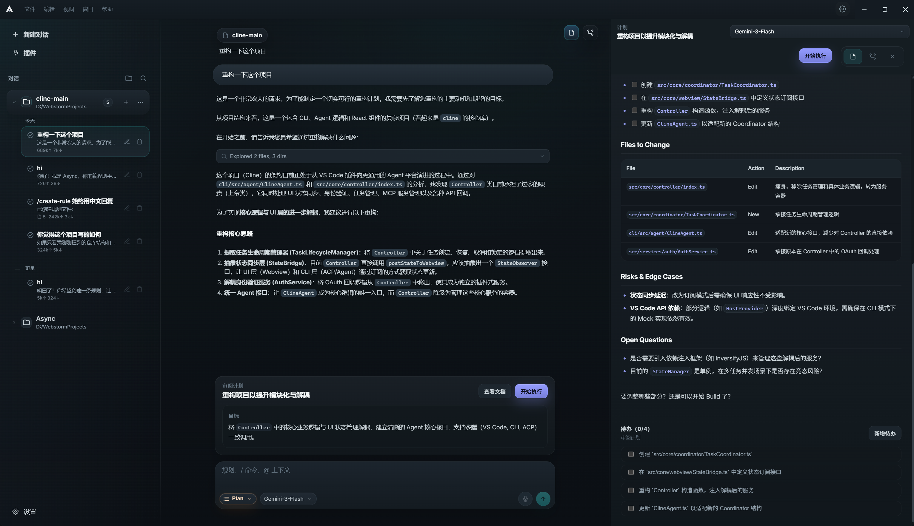
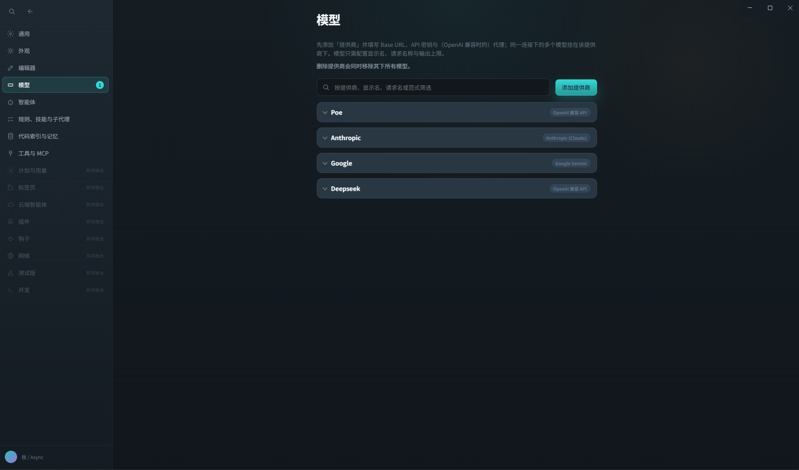
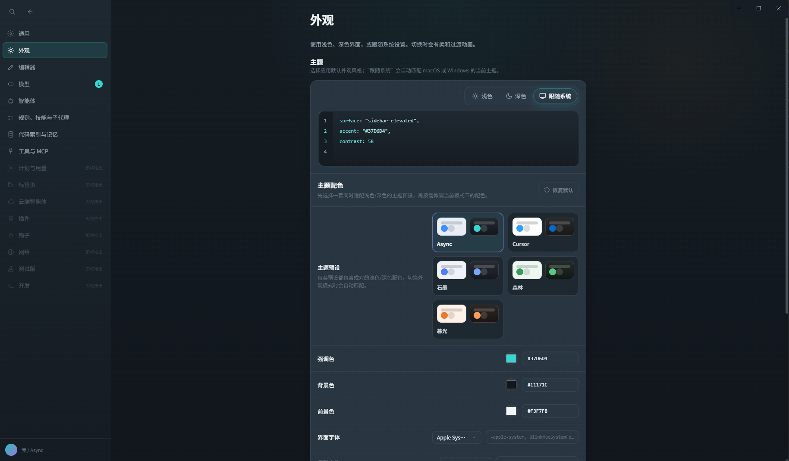

# Async IDE


**An open-source desktop shell for AI coding: agent workflow, editor, Git, and terminal in one place.**  
Built for people who like the Cursor-style workflow, but want something they can actually inspect, modify, and run with their own keys.


[English](README.md) | [简体中文](README.zh-CN.md)

---

## Why this project exists

Async IDE is an attempt to build a **Cursor-like coding workflow in the open**. The idea is simple: put the agent, Monaco editor, Git, diff/review flow, and terminal in one desktop app, but keep the stack transparent and hackable.

The project is released under **Apache 2.0**, uses **BYOK** model access, and keeps threads, settings, and plans **local-first** by default.


| Aspect                 | **Cursor**                              | **Async IDE**                                                           |
| ---------------------- | --------------------------------------- | ----------------------------------------------------------------------- |
| **License / delivery** | Proprietary product                     | **Open source** codebase you can inspect and fork                       |
| **Model access**       | Product billing / built-in integrations | **BYOK** for OpenAI, Anthropic, Gemini, and compatible APIs             |
| **Storage model**      | Product-managed workflow                | **Local-first** threads, settings, and plans                            |
| **Focus**              | Full IDE product                        | Desktop **shell** centered on agent workflow, editor, Git, and terminal |


---

## What is Async IDE?

Async IDE is an open-source desktop app for working with coding agents. Instead of treating AI as a sidebar chat, it is built around an **Agent Loop**: thinking, planning, tool execution, code edits, and review all happen in the same workspace.

### Why use Async?

- **Agent-first workflow**: the agent can work with your files, tools, and terminal through a visible **Think -> Plan -> Execute -> Observe** loop.
- **Visible tool execution**: live tool-input streaming and trajectory cards show what happened for `read_file`, `write_to_file`, `str_replace`, `search_files`, and shell steps.
- **Your keys, your machine**: bring your own providers and keep conversation history plus repo state local.
- **Git built in**: inspect status, diffs, and agent-driven changes against the real repository you are editing.
- **Multiple working modes**: switch between **Agent**, **Plan**, **Ask**, and **Debug** depending on how much autonomy you want.
- **Lean desktop stack**: Electron + React, Monaco, embedded terminal, and a codebase that is much easier to read than a giant IDE.

## Recent Progress

Recent commits have mostly focused on making the agent path feel more robust and more transparent:

- **Claude Code-style sub-agents** with nested activity UI, background execution, and better stream handling.
- **Structured assistant messages** stored as JSON, then expanded into native tool-call formats for OpenAI and Anthropic.
- **Message normalization and API repair** before tool pairing, to reduce malformed histories and orphan tool blocks.
- **Disk skills and workspace config improvements**, so local agent behavior is easier to manage.
- **Chat UI polish**, including cleaner composer visuals and more stable streaming presentation.

---

## Screenshots (partial)

### Agent Layout
<p align="center">
  
</p>


### Model Settings
<p align="center">
  
</p>


### Appearance Color Palette

<p align="center">
  
</p>

#### Cursor Theme

<p align="center">
  
</p>


---

## Core Features

### Autonomous Agent Loop

- Live tool parameter streaming and trajectory cards.
- **Plan** vs **Agent** mode: review a structured plan first, or run the tool loop directly.
- Tool approval gates for shell commands and file writes.
- Editor context sync so agent edits can focus the relevant file and line range.
- Nested sub-agent updates, background execution, and timeline-style activity rendering.

### Multi-Model Support

- Adapters for **Anthropic** (including extended thinking), **OpenAI**, and **Gemini**.
- Support for OpenAI-compatible APIs such as Ollama, vLLM, aggregators, or custom endpoints.
- Streaming reasoning / "thinking" blocks where supported.
- **Auto** mode to pick the best available model.

### Developer Experience

- **Monaco** editor with tabs, syntax highlighting, and diff review flows.
- **Git** integration for status, diff, staging, commit, and push from the UI.
- **xterm.js** terminal for both user commands and agent shell output.
- **Composer** with `@` file mentions, rich segments, and persistent threads.
- **Quick Open** palette (`Ctrl/Cmd+P`) and keyboard-first navigation.
- Built-in **i18n** support for English and Simplified Chinese.
- Local disk skills, workspace config merge, and tool approval controls for safer agent use.

---

## Technical Architecture

```text
┌─────────────────────────────────────────────────────────┐
│                    Renderer Process                    │
│  React + Vite  │  Monaco Editor  │  xterm.js Terminal  │
│  Composer / Chat / Plan / Agent UI                     │
└──────────────────────────┬──────────────────────────────┘
                           │  contextBridge (IPC)
┌──────────────────────────▼──────────────────────────────┐
│                      Main Process                      │
│  agentLoop.ts  │  toolExecutor.ts  │  LLM Adapters     │
│  gitService    │  threadStore      │  settingsStore    │
│  workspace     │  LSP session      │  PTY terminal     │
└─────────────────────────────────────────────────────────┘
```

- **Main / renderer IPC** via Electron `contextBridge` and `ipcMain`.
- `**agentLoop.ts`** handles multi-round tool calls, partial JSON streaming, tool repair, and aborts.
- **Structured assistant messages** are persisted locally and expanded to provider-native tool formats when needed.
- **Local persistence** stores threads, settings, and plans as JSON / Markdown under user data.
- `**gitService`** provides the Git layer used by the UI for status, diff, staging, commit, and push.
- **LSP** integration uses TypeScript Language Server for in-editor intelligence.

## Project Structure

```text
Async/
├── main-src/                  # Bundled -> electron/main.bundle.cjs (Node / Electron main)
│   ├── index.ts               # App entry: windows, userData, IPC registration
│   ├── agent/                 # agentLoop.ts, toolExecutor.ts, agentTools.ts, toolApprovalGate.ts
│   ├── llm/                   # OpenAI / Anthropic / Gemini adapters & streaming
│   ├── lsp/                   # TypeScript LSP session
│   ├── ipc/register.ts        # ipcMain handlers (chat, threads, git, fs, agent, ...)
│   ├── threadStore.ts         # Persistent threads + messages (JSON)
│   ├── settingsStore.ts       # settings.json
│   ├── gitService.ts          # Porcelain status, diff previews, commit/push
│   └── workspace.ts           # Open-folder root & safe path resolution
├── src/                       # Vite + React renderer
│   ├── App.tsx                # Shell layout, chat, composer modes, Git / explorer
│   ├── i18n/                  # Locale messages (en / zh-CN)
│   ├── AgentActivityGroup.tsx # Collapsible "Explored N files" activity group
│   ├── AgentResultCard.tsx    # Tool result display cards
│   └── ...                    # Agent UI, Plan review, Monaco, terminal, ...
├── electron/
│   ├── main.bundle.cjs        # esbuild output (do not edit by hand)
│   └── preload.cjs            # contextBridge -> window.asyncShell
├── docs/assets/               # Logo, screenshots
├── scripts/
│   └── export-app-icon.mjs    # Rasterize SVG -> resources/icons/icon.png
├── esbuild.main.mjs           # Builds main process
├── vite.config.ts             # Renderer build
└── package.json
```

## Local Persistence

Default layout under Electron `**userData**`:

- `**async/threads.json**`: threads and messages.
- `**async/settings.json**`: models, keys, layout, and agent options.
- `**.async/plans/**`: saved Plan documents (Markdown).

The renderer may use **localStorage** for small UI flags, but `**threads.json`** is the source of truth for conversations.

---

## Getting Started

### Prerequisites

- **Node.js** >= 18
- **npm** >= 9
- **Git** (optional but recommended)

### Install and Run

1. **Clone**:
  ```bash
   git clone https://github.com/ZYKJShadow/Async.git
   cd Async
  ```
2. **Install**:
  ```bash
   npm install
  ```
3. **Build and launch the desktop app**:
  ```bash
   npm run desktop
  ```
   This builds the main and renderer bundles, then opens Electron with `dist/index.html`.

### Development

```bash
npm run dev
```

To open DevTools during development:

```bash
npm run dev:debug
```

### Generate App Icon

```bash
npm run icons
```

This rasterizes `docs/assets/async-logo.svg` into `resources/icons/icon.png` and `public/favicon.png`.

---

## Acknowledgements

Async IDE is obviously shaped by workflows popularized by Cursor and by the broader coding-agent ecosystem.

And yes, special thanks to Claude Code for its accidental source-map-powered "open-source release". That unplanned peek behind the curtain made a lot of ideas easier to study, compare, and rebuild properly in the open.

---

## Roadmap

- Full **PTY** terminal support for a better interactive shell experience.
- Deeper **LSP** integration: go-to-definition, diagnostics, and hover.
- A **plugin / tool** extension API.
- Better large-workspace context through indexing and retrieval.
- **MCP** (Model Context Protocol) tool integration.

---

## Community

Questions, ideas, and feedback are welcome.

- **Forum**: [linux.do](https://linux.do/) - join the discussion, share your setup, or report issues.

---

## License

Licensed under the [Apache License 2.0](./LICENSE).