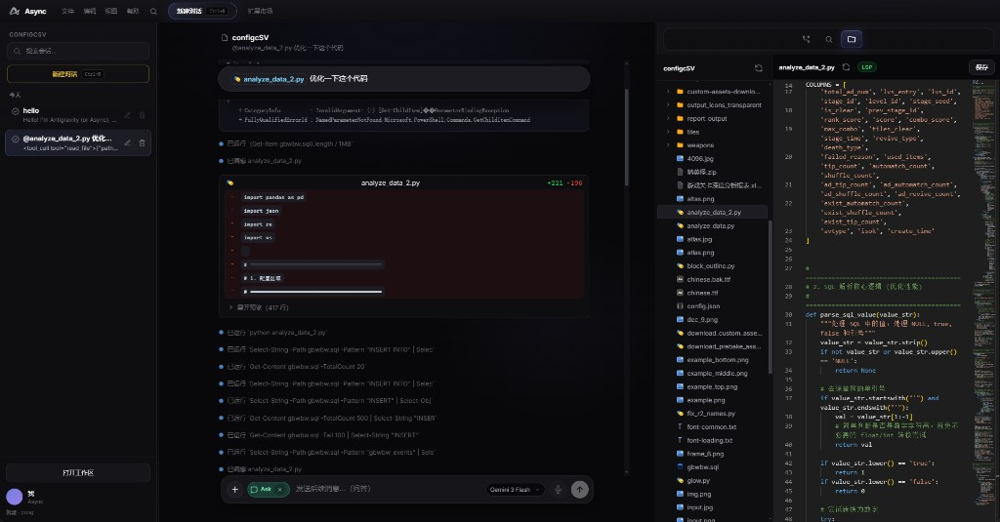

# Async Shell

<p align="center">
  
</p>

<p align="center">
  <strong>开源、可自托管的 AI 编程壳</strong> — 以对话式 Agent 为中心，把多模型对话、代码预览、Git 变更收拢在同一套界面。
</p>

<p align="center">
  
  
  
  
  
</p>

---

## 主界面预览

<p align="center">
  
</p>

## ✨ 核心特性

### 🤖 Agent 对话
- **多线程会话** — 并行多个独立对话，随时切换
- **流式输出** — 实时渲染 Agent 回复，支持中止生成
- **工具轨迹可视化** — 文件读取、写入、命令执行等工具调用以卡片形式展示
- **Plan / Review 流程** — Agent 生成计划文档，用户审核确认后再执行

### 🧠 多模型支持
- **OpenAI** 兼容 API（支持自定义 `baseURL`，适配任意 OpenAI 兼容服务）
- **Anthropic Claude** 原生适配
- **Google Gemini** 原生适配
- 模型可自由配置，在 UI 中一键切换

### 📁 工作区
- 选择本地文件夹为工作区
- **文件树浏览器** — 浏览、打开、编辑工作区文件
- 受限 IPC 读写，路径不越界

### ✏️ 内置编辑器
- 基于 **Monaco Editor** 的代码编辑
- 支持 diff 视图查看 Agent 变更
- 内联确认 / 拒绝单文件修改

### 🔀 Git 集成
- 侧栏展示仓库变更概览
- `status` 查看、暂存、提交

### 💻 终端
- 内置 **xterm.js** 终端面板
- 行级命令执行

### 🌐 国际化
- 内置 **中文 / English** 双语支持
- 可扩展更多语言

### 🎨 富文本输入
- **@-mention** 引用工作区文件
- **+ 菜单** 切换 Composer 模式（Agent / Chat 等）
- 支持 Markdown 渲染

## 🏗️ 架构概览

```
Async Shell
├── main-src/              ← Electron 主进程
│   ├── llm/               ← LLM 路由与多模型适配
│   │   ├── openaiAdapter.ts
│   │   ├── anthropicAdapter.ts
│   │   ├── geminiAdapter.ts
│   │   └── llmRouter.ts
│   ├── agent/             ← Agent 循环与工具执行
│   │   ├── agentLoop.ts
│   │   ├── agentTools.ts
│   │   └── applyAgentDiffs.ts
│   ├── ipc/               ← IPC 通道注册
│   ├── gitService.ts
│   ├── workspace.ts
│   └── settingsStore.ts
├── src/                   ← 渲染进程 (React)
│   ├── App.tsx            ← 三栏主界面
│   ├── AgentReviewPanel.tsx
│   ├── WorkspaceExplorer.tsx
│   ├── ComposerRichInput.tsx
│   ├── TerminalPane.tsx
│   ├── i18n/              ← 国际化
│   └── ...
└── electron/
    └── preload.cjs        ← IPC 白名单预加载
```

## 🚀 快速开始

### 环境要求

- **Node.js** ≥ 18
- **npm** ≥ 9
- **Git**（工作区 Git 功能需要）

### 桌面版（推荐）

```bash
git clone https://github.com/your-org/async-shell.git
cd async-shell
npm install
npm run desktop
```

构建主进程与渲染进程后，启动独立 Electron 窗口，从本地 `dist/index.html` 加载。

### 开发模式（热更新）

```bash
npm run dev
```

- Electron 窗口通过 `http://127.0.0.1:5173` 加载 Vite 开发服务器
- ⚠️ **请勿**用系统浏览器直接打开该地址（无 preload，功能受限）
- 需要调试 DevTools 时：

```bash
npm run dev:debug
```

### 仅构建

```bash
npm run build
```

构建后可通过以下方式启动：

```bash
npm run desktop
# 或直接
cross-env ASYNC_SHELL_LOAD_DIST=1 electron .
```

## ⚙️ 配置与数据

| 数据 | 路径 |
|------|------|
| 设置（API Key、Base URL、模型等） | `userData/async/settings.json` |
| 线程与消息 | `userData/async/threads.json` |
| 界面状态（侧栏宽度等） | `settings.json` |

> 若曾使用旧版目录名 `void-shell`，首次启动会自动迁移到 `async`。

## 📋 脚本一览

| 命令 | 说明 |
|------|------|
| `npm run dev` | 开发模式（主进程热更新 + Vite + Electron） |
| `npm run dev:debug` | 开发模式 + 自动打开 DevTools |
| `npm run build` | 构建主进程 + 渲染进程 |
| `npm run desktop` | 完整构建后启动桌面版 |

## 📄 文档

- [V1 产品范围](./docs/V1_SCOPE.md) — 功能边界与路线
- [LSP 集成说明](./docs/LSP_NOTES.md) — 语言服务扩展点

## 🗺️ Roadmap

- [ ] 完整 PTY 终端（`node-pty`）
- [ ] LSP 语言服务集成
- [ ] 多窗口支持
- [ ] 自动更新通道
- [ ] 更多模型适配器
- [ ] 插件 / 扩展系统

详见 [V1_SCOPE.md](./docs/V1_SCOPE.md) 了解完整范围与优先级。

## 🤝 贡献

欢迎 Issue 和 PR！建议流程：

1. Fork 本仓库
2. 创建特性分支：`git checkout -b feature/my-feature`
3. 提交更改：`git commit -m 'Add some feature'`
4. 推送分支：`git push origin feature/my-feature`
5. 提交 Pull Request

如果你希望强化某条能力（如 Agent 工具协议、diff 应用流、多模型切换），可从 [V1 范围文档](./docs/V1_SCOPE.md) 出发分阶段落地。

## 💬 与 Cursor 的关系

Async 的产品形态**对标 [Cursor](https://cursor.com)**，但实现完全独立：

- ✅ **独立实现** — 不基于 VS Code Workbench，不依赖 Cursor 闭源客户端
- ✅ **可 fork、可改** — 协议栈与 UI 完全可控
- ❌ **不做 VS Code 扩展生态** — 无 Extension Host，不装 VS Code / Open VSX 插件
- ❌ **不做云端模型路由** — 使用你自己的 API Key

## 📜 许可证

[Apache License 2.0](./LICENSE)

---

<p align="center">
  <strong>Async</strong> — 开源、可自托管的 AI 编程壳，从三栏 Agent 工作流开始。
</p>
