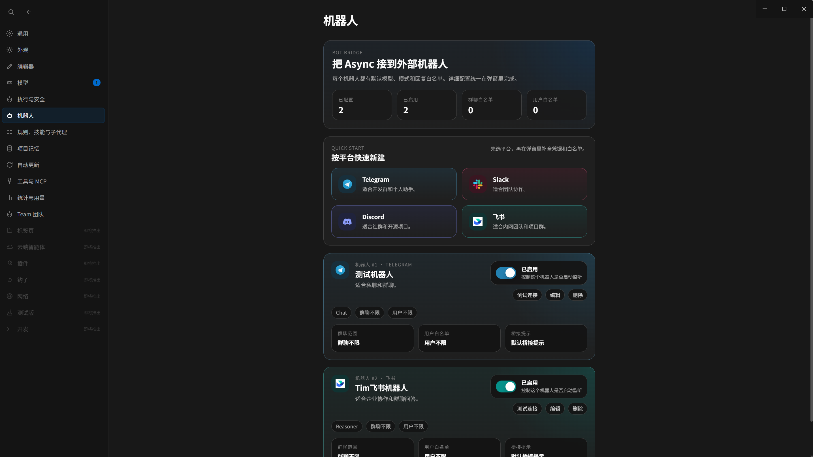

# Async IDE

<p align="center">
  
</p>

<p align="center">
  <strong>An open-source AI IDE Shell — Cursor alternative: Agent, Editor, Git, Terminal, all in one place.</strong><br/>
  Bring the Cursor workflow to your own machine with a fully open-source tech stack.
</p>

<p align="center">
  
  
  
  
  
  
</p>

<p align="center">
  <a href="README.md">English</a> | <a href="README.zh-CN.md">简体中文</a>
</p>

---

## Cursor Alternative, Open Source

The goal is simple: **match [Cursor](https://cursor.com) in features and experience** — the AI-native IDE shell with Agent, Monaco editor, workspace tools, diff review, and terminal all integrated — **but delivered as open source**: **Apache 2.0** license, **BYOK** model access, and **local-first** conversations and configuration.

You can think of it as an AI-native desktop workspace: Agent, Monaco editor, Git, diff/review flow, and terminal are all in one place, but the stack underneath is transparent and hackable. The project uses **Apache 2.0** license, **BYOK** for model access, and keeps threads, settings, and plans **local-first** by default.


| Aspect                 | **Cursor**                              | **Async IDE**                                                           |
| ---------------------- | --------------------------------------- | ----------------------------------------------------------------------- |
| **License / delivery** | Proprietary product                     | **Open source** codebase you can inspect and fork                       |
| **Model access**       | Product billing / built-in integrations | **BYOK** for OpenAI, Anthropic, Gemini, and compatible APIs             |
| **Storage model**      | Product-managed workflow                | **Local-first** threads, settings, and plans                            |
| **Focus**              | Full IDE product                        | Desktop **shell** centered on agent workflow, editor, Git, and terminal |


---

## What is Async IDE?

Async IDE is an open-source AI-native desktop application designed as your command center for working with coding agents. Rather than being a chat plugin bolted onto the side of an editor, it starts from the **Agent Loop** and brings multi-model conversations, autonomous tool execution, and review workflows into a single workspace.

### Why use Async?

- **Agent-first** — The agent can directly access your workspace, tools, and terminal through a clear **Think → Plan → Execute → Observe** loop.
- **Transparent process** — Streaming tool parameters (JSON rendered as it generates) + **tool trajectory** cards (`Read`, `Write`, `Edit`, `Glob`, `Grep`, Shell, etc.), so every step is visible.
- **Full control** — Use your own API keys, keep conversation history and repo state entirely local, with no dependency on cloud services.
- **Git-native** — Status, diffs, and agent-driven changes stay in sync with your actual repository.
- **Four Composer modes** — **Agent** (autonomous execution), **Plan** (review first, then run), **Ask** (read-only Q&A), and **Debug** (systematic troubleshooting), covering various development scenarios.
- **IM bot bridge** — Wire **Telegram**, **Slack**, **Discord**, and **Feishu (Lark)** into the same Agent / **Team** toolchain as the desktop app, with per-integration model, workspace roots, allowlists, optional HTTP proxy, and streaming replies where the platform supports it.
- **Lean shell** — Electron + React with **Agent / Editor** dual layout, Monaco + embedded terminal, following the same philosophy as Cursor but with a more focused codebase.

---

## Screenshots (partial)

### Agent Layout
<p align="center">
  
</p>

### Model Settings

<p align="center">
  
</p>

### Appearance Color Palette

<p align="center">
  
</p>

#### Cursor Theme

<p align="center">
  
</p>

### Browser tool invocation (with customizable request headers)

<p align="center">
  
</p>

### Multi-Agent Collaborative Expert Group

<p align="center">
  
</p>

### Control the entire application through external robots in a conversational manner.

<p align="center">
  
</p>

---

## Core Features

### Autonomous Agent Loop

- Streaming tool parameters with trajectory cards for clear execution visibility.
- **Plan** and **Agent** dual modes: review the plan first, or let the agent run directly.
- Approval gates for shell commands and file writes.
- Editor context sync so agent edits can focus on the relevant file and line range.
- Support for nested sub-agents, background execution, and timeline-style activity rendering.

### Multi-Model Support

- Built-in adapters for **Anthropic**, **OpenAI**, and **Gemini**.
- Support for OpenAI-compatible endpoints like Ollama, vLLM, aggregators, or self-hosted services.
- Streaming thinking blocks on supported models.
- **Auto** mode to automatically pick the best available model.

### Developer Experience

- **Monaco** editor with multi-tab support, syntax highlighting, and diff review flows.
- **Git** integration: status, diff, staging, commit, and push all available from the UI.
- **xterm.js** terminal: for both user commands and observing agent shell operations.
- **Composer** with `@` file mentions, rich segments, and persistent threads.
- **Quick Open** palette (`Ctrl/Cmd+P`) and keyboard-first navigation.
- Built-in i18n support for English and Simplified Chinese.
- Support for local disk skills, workspace config merge, and tool approval controls.

### IM / Bot integrations

Async can act as the **host** for coding agents on external chat surfaces, not only inside the Electron UI.

- **Platforms** — **Telegram**, **Slack**, **Discord**, and **Feishu (Lark)** via dedicated adapters under `main-src/bots/platforms/`.
- **Same runtime** — Inbound messages run through **`botRuntime`**: normal threads use **`agentLoop`**, while **Team** mode uses the same **`teamOrchestrator`** path as the desktop Composer, including worker streaming and tool status where applicable.
- **Per integration** — Enable/disable, display name, **default model**, **default Composer mode** (`agent` / `ask` / `plan` / `team`), **workspace root(s)**, optional **allowlists** for chats and users, and an extra **system prompt** on top of project rules.
- **Connectivity** — Optional **HTTP proxy URL** per platform (shared pattern for token calls and webhooks) when vendor APIs must go through a corporate proxy.
- **Feishu** — App credentials, optional encryption, **streaming interactive cards** for long-running replies, and session hygiene when integration settings change.
- **Configuration UI** — Managed from **Settings → Bots** (`SettingsBotsPanel.tsx`).

For a deeper module-level walkthrough, see the maintainer-oriented notes under [`docs/llm-wiki/`](./docs/llm-wiki/).

---

## Technical Architecture

```text
┌─────────────────────────────────────────────────────────┐
│                    Renderer Process                    │
│  React + Vite  │  Monaco Editor  │  xterm.js Terminal  │
│  Composer / Chat / Plan / Agent UI                     │
└──────────────────────────┬──────────────────────────────┘
                           │  contextBridge (IPC)
┌──────────────────────────▼──────────────────────────────┐
│                      Main Process                      │
│  agentLoop.ts  │  toolExecutor.ts  │  LLM Adapters     │
│  gitService    │  threadStore      │  settingsStore    │
│  workspace     │  LSP session      │  PTY terminal     │
└─────────────────────────────────────────────────────────┘
```

### Tech Stack

| Technology | Version | Purpose |
|------------|---------|---------|
| **React** | ^19.2.4 | UI framework |
| **Electron** | 41.1.0 | Desktop app shell |
| **Vite** | ^6.0.3 | Build tool & dev server |
| **TypeScript** | ^5.9.3 | Type-safe development |
| **Monaco Editor** | ^0.52.0 | Code editor component |
| **xterm.js** | ^5.5.0 | Terminal emulator |
| **OpenAI SDK** | ^4.96.0 | OpenAI API client |
| **Anthropic SDK** | ^0.39.0 | Claude API client |
| **Google Generative AI** | ^0.21.0 | Gemini API client |
| **MCP SDK** | ^1.29.0 | Model Context Protocol |
| **node-pty** | ^1.1.0 | PTY terminal support |

- **Main / renderer IPC** via Electron `contextBridge` and `ipcMain`.
- `**agentLoop.ts`** handles multi-round tool calls, partial JSON streaming, tool repair, and aborts.
- **Structured assistant messages** are persisted locally and expanded to provider-native tool formats when needed.
- **Local persistence** stores threads, settings, and plans as JSON / Markdown under user data.
- `**gitService`** provides the Git layer used by the UI for status, diff, staging, commit, and push.
- **LSP** integration uses TypeScript Language Server for in-editor intelligence.

## Project Structure

```text
Async/
├── main-src/                  # Bundled -> electron/main.bundle.cjs (Node / Electron main)
│   ├── index.ts               # App entry: windows, userData, IPC registration
│   ├── agent/                 # agentLoop.ts, toolExecutor.ts, agentTools.ts, toolApprovalGate.ts
│   ├── llm/                   # OpenAI / Anthropic / Gemini adapters & streaming
│   ├── lsp/                   # TypeScript LSP session
│   ├── mcp/                   # Model Context Protocol integration
│   ├── memdir/                # Memory directory management
│   ├── bots/                  # IM bot controller, runtime, connectivity, platform adapters
│   ├── ipc/register.ts        # ipcMain handlers (chat, threads, git, fs, agent, ...)
│   ├── shell/                 # Shell command execution
│   ├── threadStore.ts         # Persistent threads + messages (JSON)
│   ├── settingsStore.ts       # settings.json
│   ├── gitService.ts          # Porcelain status, diff previews, commit/push
│   ├── workspace.ts           # Open-folder root & safe path resolution
│   ├── workspaceFileIndex.ts  # File indexing for workspace
│   ├── workspaceSemanticIndex.ts  # Semantic search indexing
│   ├── workspaceSymbolIndex.ts    # Symbol indexing
│   └── workspaceUsageStats.ts     # Workspace usage statistics
├── src/                       # Vite + React renderer
│   ├── App.tsx                # Shell layout, chat, composer modes, Git / explorer
│   ├── AgentChatPanel.tsx     # Agent chat interface
│   ├── AgentLeftSidebar.tsx   # Agent activity sidebar
│   ├── AgentRightSidebar.tsx  # Agent tools and results
│   ├── ChatComposer.tsx       # Message composer component
│   ├── EditorMainPanel.tsx    # Monaco editor panel
│   ├── SettingsPage.tsx       # Settings UI
│   ├── SettingsBotsPanel.tsx  # IM bot integrations (Telegram / Slack / Discord / Feishu)
│   ├── WorkspaceExplorer.tsx  # File explorer
│   ├── hooks/                 # Custom React hooks (19 files)
│   ├── i18n/                  # Locale messages (en / zh-CN)
│   └── ...                    # Agent UI, Plan review, Monaco, terminal, ...
├── electron/
│   ├── main.bundle.cjs        # esbuild output (do not edit by hand)
│   └── preload.cjs            # contextBridge -> window.asyncShell
├── docs/assets/               # Logo, screenshots
├── scripts/
│   └── export-app-icon.mjs    # Rasterize SVG -> resources/icons/icon.png
├── esbuild.main.mjs           # Builds main process
├── vite.config.ts             # Renderer build
└── package.json
```

## Data Storage

Default location under Electron's **`userData`** directory:

- **`async/threads.json`**: threads and chat messages.
- **`async/settings.json`**: model configuration, API keys, layout, agent options, and **`bots.integrations`** (Telegram / Slack / Discord / Feishu tokens, proxy URLs, allowlists, defaults).
- **`.async/plans/`**: Markdown plan documents generated in Plan mode.

The renderer may use **localStorage** for lightweight UI state, but the authoritative data source for conversations is **`threads.json`**.

---

## Getting Started

### Prerequisites

- **Node.js** >= 18
- **npm** >= 9
- **Git** (recommended)

### Install and Run

1. **Clone the repository**:

   ```bash
   git clone https://github.com/ZYKJShadow/Async.git
   cd Async
   ```

   If you prefer Gitee, you can also use:

   ```bash
   git clone https://gitee.com/shadowsocks_z/Async.git
   cd Async
   ```

2. **Install dependencies**:

   ```bash
   npm install
   ```

3. **Build and launch the desktop app**:

   ```bash
   npm run desktop
   ```

   This will build both the main and renderer processes, then open the app with Electron.

### Development

```bash
npm run dev
```

To open DevTools during development:

```bash
npm run dev:debug
```

### Generate App Icon

```bash
npm run icons
```

This will rasterize `docs/assets/async-logo.svg` into `resources/icons/icon.png` and `public/favicon.png`.

---

## Acknowledgements

We genuinely need to thank Claude Code for its "open-source moment" — Async IDE as an open-source alternative is, in a way, an indirect beneficiary of that.

---

## Community

Have questions, ideas, or just want to chat with a community of developers?

- **Forum**: [linux.do](https://linux.do/) — Join the discussion, share your setup, report issues, and stick around.

---

## License

This project is open-sourced under the [Apache License 2.0](./LICENSE).