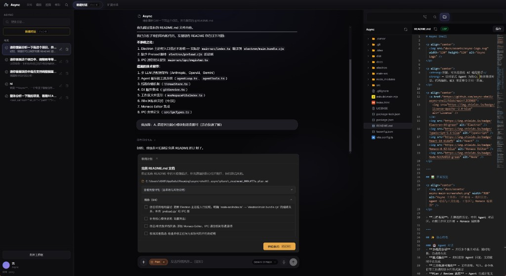

# Async Shell

<p align="center">
  
</p>

<p align="center">
  <strong>以 Agent 为中心的 AI IDE Shell。</strong><br>
  为追求精简、自主 Agent 工作流的开发者打造。
</p>

<p align="center">
  
  
  
  
  
</p>

---

[English](README.md) | [简体中文](README.zh-CN.md)

---

## 🌟 什么是 Async Shell？

Async Shell 是一款开源的 AI 原生桌面应用，作为你与 AI Agent 之间的主界面。与「在现有 IDE 里挂一个聊天窗」不同，Async 从底层围绕 **Agent 循环** 设计，把多模型对话、自主工具执行与代码审阅放在同一套工作区里。

### 为什么选择 Async？

- **Agent 优先**：不仅是侧边对话；Agent 对工作区、工具和终端有一致的访问能力。
- **自主可控**：自托管、可配置；使用你自己的 OpenAI / Anthropic / Gemini 等密钥。
- **轻量三栏布局**：Electron + React，左侧会话、中间对话与 Plan/Agent、右侧资源管理器 / Git / 编辑器。
- **过程可见**：工具调用轨迹、流式工具参数、思考块等，接近主流 AI IDE 的反馈体验。
- **Git 感知**：在可用 Git 且为仓库时，底部「改动文件」条以 **`git status` / `git diff`** 为准判断是否真的改动及行数；无 Git 或非仓库时回退为从对话解析的统计。

### 📸 界面预览

<p align="center">
  
</p>

### 📋 Plan 模式

**Plan** 模式下，模型会输出结构化计划（标题、说明、任务勾选列表，以及可选的澄清问题）。你审阅草稿、勾选或理解任务后，点击 **「开始执行」** 再让 Agent 按计划在仓库里落地修改。草稿计划会保存到应用用户数据目录（例如 **`.async/plans/`**）下的 Markdown 文件。

<p align="center">
  
</p>

## ✨ 核心特性

### 🤖 自主 Agent
- **工具轨迹**：读文件、写文件、搜索、终端命令等以卡片形式展示；模型流式输出工具参数时支持实时预览。
- **Agent / Plan 分流**：**Agent** 走原生工具循环（`read_file`、`write_to_file`、`str_replace` 等）；**Plan** 侧重结构化规划与确认后再执行。
- **多线程会话**：多条会话并行，状态持久化到磁盘（见下文 **持久化**）。
- **流式输出**：正文流式、可选思考内容、工具入参增量，减少「一次性蹦出结果」的突兀感。

### 🧠 多模型
- 主进程 LLM 层支持 **Anthropic**、**OpenAI 兼容**、**Gemini** 等请求路径。
- 任意 OpenAI 兼容 Base URL（本地模型、中转服务）可走兼容适配器。
- 在输入区切换模型，线程上下文仍保留。

### 🛠️ 开发体验
- **Monaco 编辑器**：应用内编辑与 Diff。
- **Git**：状态、Diff 预览、暂存、提交、推送（需本机安装 `git` 且工作区为 Git 仓库）。
- **集成终端**：基于 xterm.js。
- **@ 提及**：在输入区引用工作区文件。
- **国际化**：界面支持英文与简体中文。

## 🏗️ 项目结构

```text
async-shell/
├── main-src/                 # 经 esbuild 打包为 electron/main.bundle.cjs
│   ├── index.ts              # 入口：窗口、userData、注册 IPC
│   ├── agent/                # agentLoop、工具执行、工具定义
│   ├── llm/                  # 各厂商适配与流式解析
│   ├── ipc/register.ts       # ipcMain：聊天、线程、git、fs、agent 等
│   ├── threadStore.ts        # 线程与消息持久化（JSON）
│   ├── settingsStore.ts      # settings.json
│   ├── gitService.ts         # porcelain 状态、diff 预览、提交推送
│   └── workspace.ts          # 工作区根路径与安全路径解析
├── src/                      # Vite + React 渲染进程
│   ├── App.tsx               # 壳布局、聊天、Composer 模式、Git/资源管理器
│   ├── i18n/                 # 文案
│   └── …                     # Agent UI、Plan 审阅、Monaco、终端等
├── electron/
│   ├── main.bundle.cjs       # esbuild 产物（勿手改）
│   └── preload.cjs           # contextBridge → window.asyncShell
├── esbuild.main.mjs          # 主进程构建
├── vite.config.ts            # 渲染进程构建
└── package.json
```

## 💾 持久化（本地）

默认情况下，数据位于 Electron **`userData`** 下：

- **`userData/async/threads.json`** — 线程列表与聊天记录。
- **`userData/async/settings.json`** — 模型、密钥（仅存本机）、布局、Agent 相关选项等。
- **`userData/.async/plans/`** — Plan 模式落盘的计划 Markdown。

渲染进程可能使用 **localStorage** 保存少量 UI 状态（例如 Agent 底部改动条的收起状态）；**对话正文以 `threads.json` 为准**。

## 🚀 快速开始

### 环境要求
- **Node.js** ≥ 18  
- **npm** ≥ 9  
- **Git**（可选；不装则内置 Git 能力不可用或降级）

### 安装与运行

1. **克隆仓库**:
   ```bash
   git clone https://github.com/your-org/async-shell.git
   cd async-shell
   ```

2. **安装依赖**:
   ```bash
   npm install
   ```

3. **启动应用**:
   ```bash
   npm run desktop
   ```
   会构建主进程与渲染产物到 `dist/`，再以 Electron 加载 `dist/index.html`。

### 开发模式

渲染进程热更新 + 主进程 watch 构建：

```bash
npm run dev
```

可选打开开发者工具：

```bash
npm run dev:debug
```

## 🗺️ 路线图
- [ ] **完整 PTY 终端**（如 `node-pty`）。
- [ ] **LSP 集成**，在编辑器内跳转、诊断等。
- [ ] **插件系统**，扩展工具与 Agent 行为。
- [ ] **更强上下文**（RAG / 索引）以支撑超大仓库。

## 📜 许可证
本项目采用 [Apache License 2.0](./LICENSE) 开源协议。
