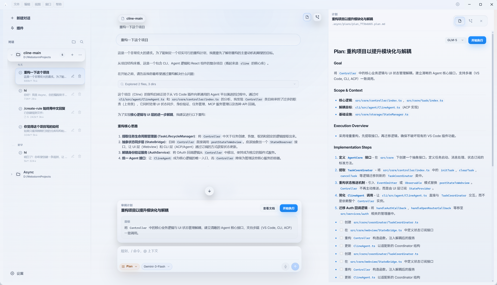

# Async Shell

<p align="center">
  
</p>

<p align="center">
  <strong>开源 AI IDE Shell —— 对标 Cursor：Agent、编辑器、Git、终端，一个都不少。</strong><br/>
  用完全开放的技术栈，把 Cursor 那套玩法搬到你自己手里。
</p>

<p align="center">
  
  
  
  
  
  
</p>

<p align="center">
  <a href="README.md">English</a> | <a href="README.zh-CN.md">简体中文</a>
</p>

---

## 对标 Cursor，开源实现

说白了就一个目标：**在功能和体验上对标 [Cursor](https://cursor.com)**——AI 原生 IDE Shell，Agent、Monaco 编辑器、工作区工具、Diff 审阅、终端全部拧成一股绳——**但以开源方式交付**：**Apache 2.0** 协议，**自带模型密钥（BYOK）**，对话与配置默认**存在本地**。

你可以把它理解成一个 AI 原生桌面工作区：Agent、Monaco 编辑器、Git、Diff 审阅、终端都放在一起，但底层是透明的、可以自己研究也可以自己改。项目使用 **Apache 2.0** 协议，模型接入走 **BYOK**，线程、设置、计划默认都是 **本地优先**。

| 维度 | **Cursor** | **Async Shell** |
| --- | --- | --- |
| **交付方式** | 商业产品 | **开源代码**，可读、可改、可自建 |
| **模型接入** | 平台内计费 / 集成 | **BYOK**，支持 OpenAI、Anthropic、Gemini 和兼容接口 |
| **数据存储** | 产品侧管理 | **本地优先**，线程、设置、计划都在你机器上 |
| **产品重点** | 完整 IDE 产品 | 更聚焦的桌面 **Shell**：Agent、编辑器、Git、终端 |

---

## Async Shell 是什么？

Async Shell 是一款开源的 AI 原生桌面应用，定位是你和 Agent 之间的主战场。它不是那种缝在编辑器侧边的聊天插件，而是从 **Agent 循环**出发，把多模型对话、自主工具执行、审阅确认都塞进同一个工作区里。

### 为什么选 Async？

- **Agent 优先** —— Agent 可以直接访问你的工作区、工具和终端，走的是清晰的**思考 → 规划 → 执行 → 观察**闭环。
- **过程透明** —— 流式工具参数（JSON 边生成边展示）+ **工具轨迹**卡片（`read_file`、`write_to_file`、`str_replace`、`search_files`、Shell 等），每一步都看得见。
- **自主可控** —— 用你自己的 API 密钥，对话记录和仓库状态全在本地，不依赖任何云端服务。
- **Git 原生** —— 状态、Diff、Agent 改动和真实仓库实时同步。
- **四种 Composer 模式** —— **Agent**（自主执行）、**Plan**（先审后跑）、**Ask**（只读问答）、**Debug**（系统排查），覆盖日常开发的各种场景。
- **轻量外壳** —— Electron + React，**Agent / Editor** 双布局，Monaco + 内嵌终端，整体思路和 Cursor 一脉相承，代码体量更聚焦。

---

## 界面预览

<p align="center">
  
</p>

<p align="center">
  
</p>

### 模型设置

<p align="center">
  
</p>

---

## 核心特性

### 自主 Agent 循环

- 工具参数流式展示，配合轨迹卡片，执行过程比较清楚。
- **Plan** 和 **Agent** 双模式：可以先看计划，也可以直接让 Agent 开跑。
- Shell 命令和文件写入支持审批门控。
- Agent 改代码时，可以联动编辑器定位到对应文件和行范围。
- 支持嵌套子 Agent、后台执行和时间线式活动展示。

### 多模型支持

- 内置 **Anthropic**、**OpenAI**、**Gemini** 适配。
- 支持兼容 OpenAI 接口的各种端点，比如 Ollama、vLLM、聚合 API、自建服务。
- 在支持的模型上展示流式思考块。
- **Auto** 模式可以自动挑当前最合适的模型。

### 开发体验

- **Monaco** 编辑器，支持多标签页、语法高亮和 Diff 审阅流程。
- **Git** 集成：状态、Diff、暂存、提交、推送都能在 UI 里完成。
- **xterm.js** 终端：既能自己用，也能看 Agent 触发了什么 Shell 操作。
- **Composer** 支持 `@` 文件引用、多段消息和线程持久化。
- **快速打开**（`Ctrl/Cmd+P`）和整体键盘优先的交互。
- 内置中英文国际化。
- 支持本地 disk skills、工作区配置合并和工具审批控制。

---

## 技术架构

```text
┌─────────────────────────────────────────────────────────┐
│                      渲染进程                           │
│  React + Vite  │  Monaco 编辑器  │  xterm.js 终端      │
│  Composer / Chat / Plan / Agent UI                     │
└──────────────────────────┬──────────────────────────────┘
                           │  contextBridge（IPC）
┌──────────────────────────▼──────────────────────────────┐
│                       主进程                            │
│  agentLoop.ts  │  toolExecutor.ts  │  LLM 适配器       │
│  gitService    │  threadStore      │  settingsStore    │
│  workspace     │  LSP 会话         │  PTY 终端         │
└─────────────────────────────────────────────────────────┘
```

- 主进程和渲染进程分离，通过 Electron `contextBridge` 和 `ipcMain` 通信。
- **`agentLoop.ts`** 负责多轮工具调用、流式 JSON 片段、工具修复和中止控制。
- Assistant 消息支持结构化持久化，需要时再展开成不同模型原生的 tool 格式。
- 线程、设置、计划等数据默认以 JSON / Markdown 形式落在本地。
- **`gitService`** 提供 UI 用到的 Git 操作层。
- **LSP** 目前接入了 TypeScript Language Server。

## 项目结构

```text
Async/
├── main-src/                  # 主进程源码，最终打包到 electron/main.bundle.cjs
│   ├── index.ts               # 应用入口：窗口、userData、IPC 注册
│   ├── agent/                 # agentLoop.ts、toolExecutor.ts、agentTools.ts 等
│   ├── llm/                   # OpenAI / Anthropic / Gemini 适配器与流式处理
│   ├── lsp/                   # TypeScript LSP 会话
│   ├── ipc/register.ts        # IPC 处理函数（聊天、线程、Git、文件系统等）
│   ├── threadStore.ts         # 线程与消息持久化
│   ├── settingsStore.ts       # settings.json 管理
│   ├── gitService.ts          # Git 状态、Diff、提交、推送
│   └── workspace.ts           # 工作区根目录与安全路径解析
├── src/                       # 渲染进程（Vite + React）
│   ├── App.tsx                # 主界面、聊天、Composer 模式、Git / 文件树
│   ├── i18n/                  # 中英文文案
│   ├── AgentActivityGroup.tsx # “已探索 N 个文件” 折叠组
│   ├── AgentResultCard.tsx    # 工具结果卡片
│   └── ...                    # Agent UI、Plan 审阅、Monaco、终端等组件
├── electron/
│   ├── main.bundle.cjs        # esbuild 产物，不建议手改
│   └── preload.cjs            # 预加载脚本 -> window.asyncShell
├── docs/assets/               # Logo、截图
├── scripts/
│   └── export-app-icon.mjs    # SVG -> PNG 图标导出
├── esbuild.main.mjs           # 主进程构建脚本
├── vite.config.ts             # 渲染进程构建配置
└── package.json
```

## 数据存储

默认位于 Electron 的 **`userData`** 目录下：

- **`async/threads.json`**：线程和聊天消息。
- **`async/settings.json`**：模型配置、密钥、布局和 Agent 选项。
- **`.async/plans/`**：Plan 模式生成的 Markdown 计划文件。

渲染进程可能会用 **localStorage** 存一些轻量 UI 状态，但对话的权威数据源还是 **`threads.json`**。

---

## 快速开始

### 环境要求

- **Node.js** >= 18
- **npm** >= 9
- **Git**（建议安装）

### 安装与运行

1. **克隆仓库**：

   ```bash
   git clone https://github.com/ZYKJShadow/Async.git
   cd Async
   ```

   如果你更习惯 Gitee，也可以使用：

   ```bash
   git clone https://gitee.com/shadowsocks_z/Async.git
   cd Async
   ```

2. **安装依赖**：

   ```bash
   npm install
   ```

3. **构建并启动桌面应用**：

   ```bash
   npm run desktop
   ```

   这会先构建主进程和渲染进程，然后用 Electron 打开应用。

### 开发模式

```bash
npm run dev
```

如果需要同时打开 DevTools：

```bash
npm run dev:debug
```

### 生成应用图标

```bash
npm run icons
```

会把 `docs/assets/async-logo.svg` 光栅化成 `resources/icons/icon.png` 和 `public/favicon.png`。

---

## 致谢

确实也得认真感谢一下 Claude Code 带来的“开源时刻”，Async Shell 这种开源替代方案，也算是间接受益者之一。

---

## 路线图

- [ ] 完整 **PTY** 终端，增强 Shell 交互体验。
- [ ] **LSP** 深度集成（跳转定义、诊断、悬浮提示）。
- [ ] **插件 / 工具**扩展机制，让社区能接入自定义工具。
- [ ] **超大仓库上下文**（语义索引 / 类 RAG 检索）。
- [ ] **MCP**（Model Context Protocol）工具集成。

---

## 社区交流

有问题、有想法，或者就是想和一群搞开发的人聊聊？

- **论坛**：[linux.do](https://linux.do/) —— 来这里讨论、分享你的配置、反馈问题，欢迎常驻。

---

## 许可证

本项目基于 [Apache License 2.0](./LICENSE) 协议开源。
